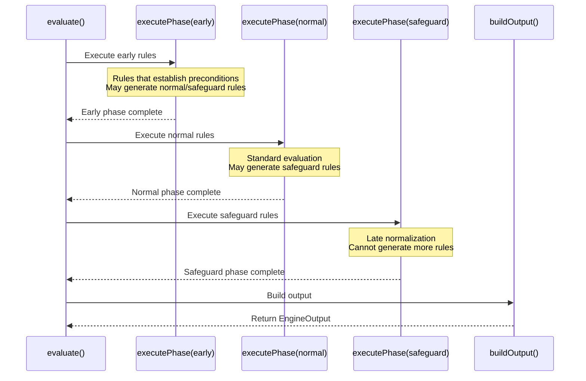
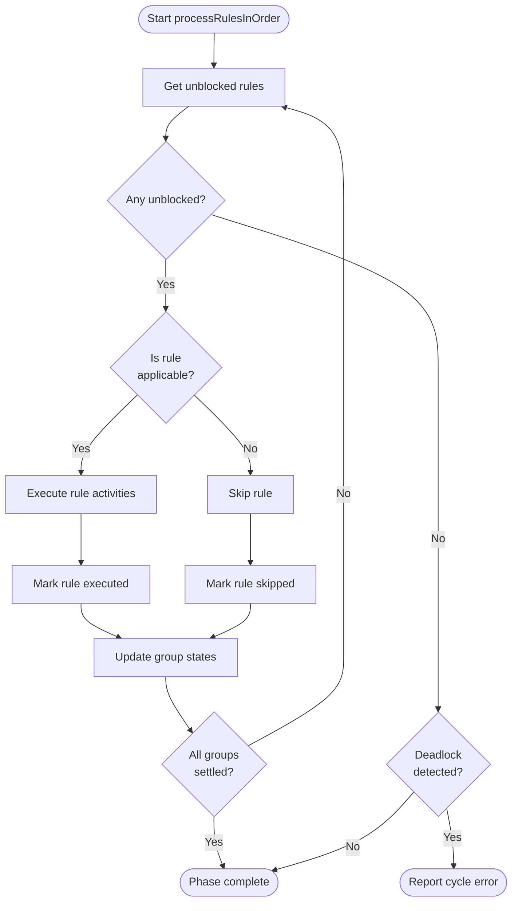

# Rules Engine Function Call Flow

```mermaid
flowchart TD
    subgraph evaluate.ts
        evaluate["evaluate(input)"]
    end

    subgraph functions.ts
        createRegistry["createBuiltinFunctionRegistry()"]
        statToMod["statToModifierHandler()"]
    end

    subgraph ordering.ts
        buildGroups["buildGroupStates()"]
        isSettled["isGroupSettled()"]
        depsSatisfied["areDependenciesSatisfied()"]
        markExec["markRuleExecuted()"]
        markSkip["markRuleSkipped()"]
        validateOrder["validateOrdering()"]
        validateCross["validateCrossPhaseOrdering()"]
    end

    subgraph phases.ts
        executePhase["executePhase(phase)"]
        getRules["getRulesForPhase()"]
        processRules["processRulesInOrder()"]
    end

    subgraph conditions.ts
        isApplicable["isRuleApplicable()"]
        evalWhen["evaluateWhenConditions()"]
        evalCond["evaluateCondition()"]
    end

    subgraph activities.ts
        execActivities["executeRuleActivities()"]
        execActivity["executeActivity()"]
        numSet["executeNumberSet()"]
        numInc["executeNumberIncrement()"]
        numCopy["executeNumberCopy()"]
        numSum["executeNumberSum()"]
        numFunc["executeNumberFunction()"]
        emitEvt["executeEmitEvent()"]
        genRule["executeGenerateRule()"]
        offerRule["executeOfferRule()"]
    end

    subgraph output.ts
        buildOut["buildOutput()"]
        buildStat["buildStatus()"]
        buildNext["buildNextInput()"]
        getPersist["getPersistableEffects()"]
    end

    %% Main flow
    evaluate --> createRegistry
    evaluate --> buildGroups
    evaluate --> validateOrder
    evaluate --> validateCross
    evaluate --> executePhase

    %% Phase execution
    executePhase --> getRules
    executePhase --> processRules
    processRules --> isApplicable
    processRules --> depsSatisfied
    processRules --> execActivities
    processRules --> markExec
    processRules --> markSkip

    %% Condition evaluation
    isApplicable --> evalWhen
    evalWhen --> evalCond

    %% Dependency checking
    depsSatisfied --> isSettled

    %% Activity execution
    execActivities --> execActivity
    execActivity --> numSet
    execActivity --> numInc
    execActivity --> numCopy
    execActivity --> numSum
    execActivity --> numFunc
    execActivity --> emitEvt
    execActivity --> genRule
    execActivity --> offerRule

    %% Function registry
    numFunc -.-> createRegistry

    %% Offer rule uses conditions
    offerRule -.-> evalWhen

    %% Output construction
    evaluate --> buildOut
    buildOut --> buildStat
    buildOut --> buildNext
    buildNext --> getPersist

    %% Styles
    classDef main fill:#4a90d9,stroke:#2c5aa0,color:#fff
    classDef phase fill:#7cb342,stroke:#558b2f,color:#fff
    classDef condition fill:#ff9800,stroke:#e65100,color:#fff
    classDef activity fill:#9c27b0,stroke:#6a1b9a,color:#fff
    classDef output fill:#607d8b,stroke:#37474f,color:#fff

    class evaluate main
    class executePhase,processRules,getRules phase
    class isApplicable,evalWhen,evalCond,depsSatisfied,isSettled condition
    class execActivities,execActivity,numSet,numInc,numCopy,numSum,numFunc,emitEvt,genRule,offerRule activity
    class buildOut,buildStat,buildNext,getPersist output
```

## Phase Execution Order

```mermaid
sequenceDiagram
    participant E as evaluate()
    participant EP as executePhase(early)
    participant NP as executePhase(normal)
    participant SP as executePhase(safeguard)
    participant O as buildOutput()

    E->>EP: Execute early rules
    Note over EP: Rules that establish preconditions<br/>May generate normal/safeguard rules
    EP-->>E: Early phase complete

    E->>NP: Execute normal rules
    Note over NP: Standard evaluation<br/>May generate safeguard rules
    NP-->>E: Normal phase complete

    E->>SP: Execute safeguard rules
    Note over SP: Late normalization<br/>Cannot generate more rules
    SP-->>E: Safeguard phase complete

    E->>O: Build output
    O-->>E: Return EngineOutput
```

## Rule Processing Within a Phase

```mermaid
flowchart TD
    start([Start processRulesInOrder]) --> getUnblocked[Get unblocked rules]
    getUnblocked --> anyUnblocked{Any unblocked?}

    anyUnblocked -->|Yes| checkApplicable{Is rule<br/>applicable?}

    checkApplicable -->|Yes| execute[Execute rule activities]
    execute --> markExec2[Mark rule executed]
    markExec2 --> updateGroups[Update group states]

    checkApplicable -->|No| skip[Skip rule]
    skip --> markSkip2[Mark rule skipped]
    markSkip2 --> updateGroups

    updateGroups --> checkSettled{All groups<br/>settled?}
    checkSettled -->|No| getUnblocked

    checkSettled -->|Yes| done([Phase complete])

    anyUnblocked -->|No| deadlock{Deadlock<br/>detected?}
    deadlock -->|Yes| error([Report cycle error])
    deadlock -->|No| done
```
